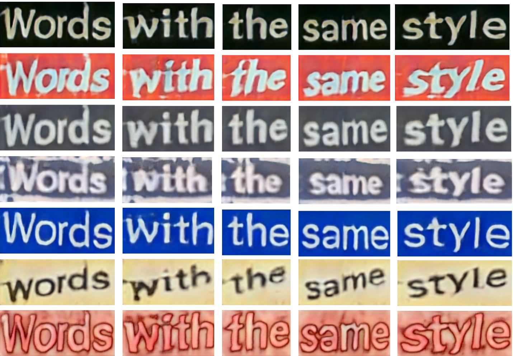
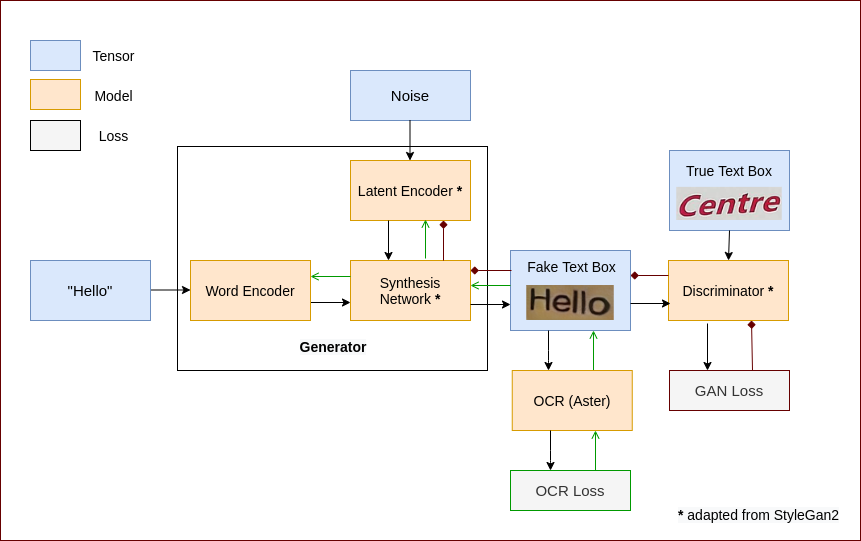
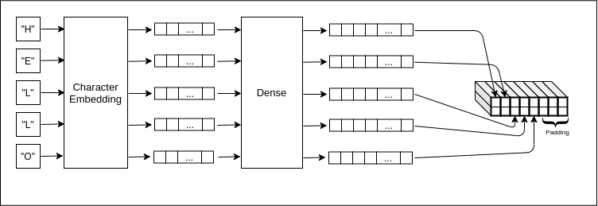
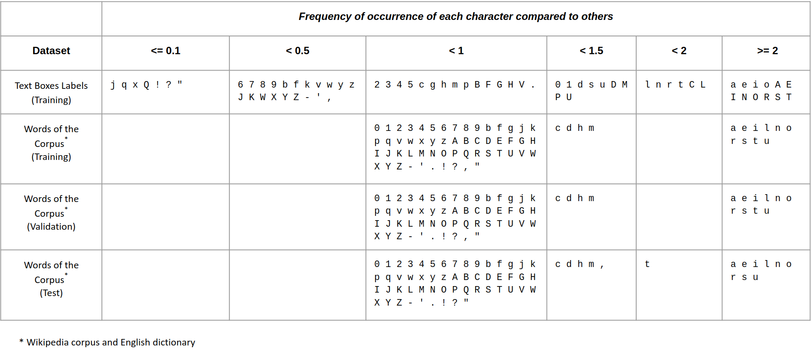
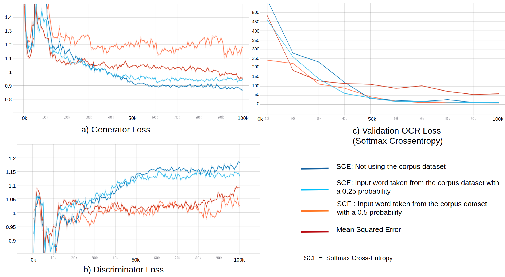
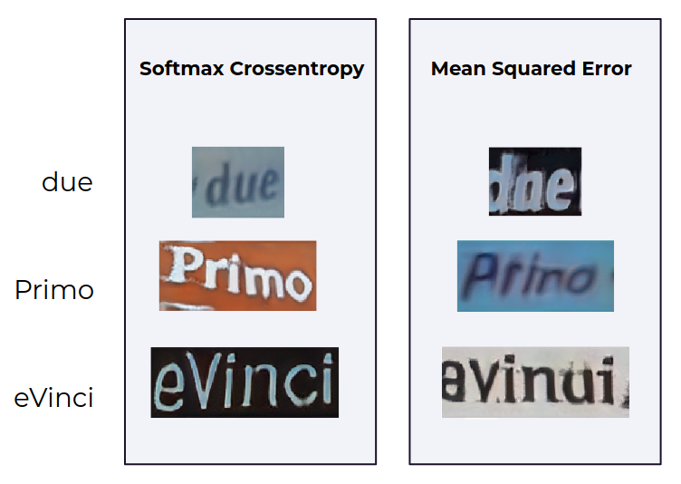
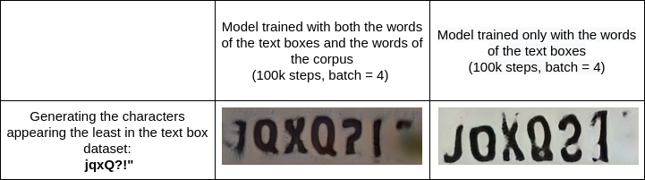
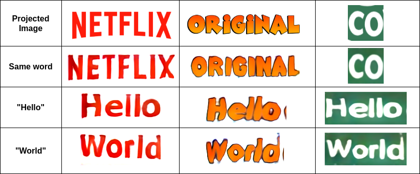

# TextBoxGAN

Generates text boxes from input words with a Generative Adversial Network.

Video: Generating the word "Generate" at different training steps: **https://youtu.be/YdicGxqRWOY**

<p align="center">_Figure 1: Different examples
of generating "Words with the same style" using our model_<p>

## Contents

[Setup](#setup)  
[Running](#running)  
[Network](#network)  
[Datasets](#datasets)  
[Inference](#inference)  
[Results](#results)  
[Projector](#projector)  
[Conclusion](#conclusion)  
[Implementation Details](#implementation-details)

<a name="setup"/>

## Setup

#### Requirements

- Docker
- 1 or more CUDA compatible GPUs (currently the project runs on GPU only)

#### Download the models

The following models are available in [google drive]:

- **trained model**: pretrained model (c.f. the [Results](#results) section for more details on the model). Place this
  directory in the [experiments](experiments) directory. To use it, replace `EXPERIMENT_NAME = None` with
  `EXPERIMENT_NAME = "trained model"`, and ensure `cfg.resume_step = 225000` in the [config](config/config.py) file.
- **aster_weights**: weights of the [ASTER] OCR converted to tf2. Place this directory at the root of the project. Required
  for training the model, running the projector and inferring the test set.
- **perceptual_weights**: weights of the perceptual loss, converted from pytorch using a repo of [moono]. Place this
  directory in the [projector](projector) directory. Required for running the projector.

#### Build the docker

```bash
docker build -t textboxgan .
```

#### Run the docker

```bash
docker run --gpus all -it -v `pwd`:/tmp -w /tmp textboxgan bash
```

#### Download and make datasets

In the docker, run:

```bash
make download-and-make-datasets
```

<a name="running"/>

## Running

_All the following commands should be run within the docker._

#### Training

Specify all the configs in [config.py](config/config.py).

```bash
poetry run python train.py
```

#### Generate chosen words

Generate "Hello" and "World" 20 times:

```bash
poetry run python infere.py --infere_type "chosen_words" --words_to_generate "Hello" "World" --num_inferences 20 --output_dir "/"
```

#### Infere the test set

Get an average over 50 runs (since random vectors are used, the test set result is not constant):

```bash
poetry run python infere.py --infere_type "test_set" --num_test_set_run 50
```

#### Run the projector

```bash
poetry run python -m projector.projector --target_image_path "path/to/image" --text_on_the_image "ABCDE" --output_dir "/"
```

<a name="network"/>

## Network

<p align="center">_Figure 2: Network architecture. The green and brown arrows
represents the backpropagation of respectively the OCR and GAN losses_<p>

<p align="center">_Figure 3: Word Encoder_<p>

_All hyperparameters stated below can be configured in [config.py](config/config.py)._

**Inputs**:

- Words whose length are less or equal to _max_char_number_.
- A normally distributed random vector of shape _(batch_size, z_dim)_.

**Word Encoder [(code)](models/word_encoder.py):** Computes a vector representation for each
character of the input word using an embedding followed by a dense layer. The tensor containing
all the characters encoded is then reshaped, while preserving the order of the characters. This tensor
is then 0 padded since the generator requires a fixed size input, regardless of the word's length. This process is
described in _Figure 3_. In the code,
the integer sequence representing the word is 0 padded in the data loader , and the corresponding embedding
is filled with 0s.

**Latent Encoder [(code)](models/stylegan2/latent_encoder.py)** _(Refer to the [StyleGan2] paper for more information)_
**:** Generates the style of the image by encoding the noise vector through _n_mapping_ dense layers,
leading to a tensor of size _(batch_size, style_dim)_ where _style_dim_ is usually equal to _z_dim_. The resulting
tensor is duplicated _n_style_ times, where _n_style_ is equal to the number of layers in the Synthesis Network.
During training, a second style vector is generated and is mixed with the first one to broaden the distribution of the
generated images. During evaluation, the style vector can be truncated to vary its intensity.

**Synthesis Network [(code)](models/stylegan2/layers/synthesis_block.py)** \*(Refer to the [StyleGan2] paper for more
information)**\*:** Synthesises a text box from a word encoded tensor and a style vector. At each layer, the style
vectors are directly applied on the kernels instead of the image for efficiency purpose. RGB images are generated at
each upscaling and added up, allowing the network to train better globally (and not only train the final layers).

<a name="handling-words-different-sizes"/>

**Handling words of different sizes**: The text box generated by the synthesis network has a fixed width, regardless of
the number N of characters in the input word. To handle words of different sizes, and hence images of different widths,
a mask is applied on the text box before feeding it to the discriminator. It is assumed that each character has a width
_char_width_ = _image_width_ / _max_char_number_. Thus, the mask zeroes all elements where the corresponding width is
beyond N \* _char_width_. This both allows to force the synthesis network to not distort characters, and prevents the
discriminator from using residual noise as a pattern to distinguish from fake and real boxes. Similarly, real text
boxes are resized and zero padded according to the length of their label.

**Discriminator [(code)](models/stylegan2/discriminator.py)** \*(Refer to the [StyleGan2] paper for more information)**\*:**
Classifies the text boxes into fake or real.

**OCR (ASTER) [(code)](aster_ocr_utils/aster_inferer.py)**: \*(Refer to the [ASTER] paper for more information)**\*:**
Recognizes the characters present in a text box with a combination of a CNN and an attention RNN. A pre-trained model
is utilised to train our model and the weights are fixed. Since the RNN is
bidirectional, it outputs two predictions: one with the word written in the right direction, and the other one backward.
Combining both predictions allows, in theory, to reach a more accurate prediction (not with our pre-trained model).
The prediction consists in a 2D array of logits, representing the probability of being each possible characters for each
character identified in the text box.

**OCR Loss [(code)](models/losses/ocr_losses.py)**: Two possible losses were experimented:

- **Softmax crossentropy (SCE):** applied between the OCR's output logits of the generated text box and the label, i.e. the input
  word.
- **Mean squared error (MSE):** applied between the OCR's output logits of the generated text box and those of a real text box, with
  the same label. Hence, our problem is modeled as a regression rather than a classification.

**GAN Loss / Regularization**:

- **SoftPlus [(code)](models/losses/gan_losses.py):** applied on the discriminator prediction, to train both the discriminator
  and the generator.
- **Path Length Regularization [(code)](training_step.py):** encourages the derivative of the generated image
  with respect to the style vector generated by the Latent Encoder to remain constant. As result, a change in the style
  vector leads to a proportional perceptual change in the output image, leading to a more consistent behavior of the
  generator. More details [here](https://paperswithcode.com/method/path-length-regularization#:~:text=Path%20Length%20Regularization%20is%20a,magnitude%20change%20in%20the%20image.).
- **R1 Regularization [(code)](training_step.py):** stabilizes the overall training through the application of a
  gradient penalty on the Discriminator, forcing it to remain within the Nash Equilibrium. More details
  [here](https://paperswithcode.com/method/r1-regularization).

The GAN loss is not propagated through the Word Encoder, as it encourages the latter to output a fixed value, regardless
of the word, since it is easing the task of the Synthesis Network.

<a name="datasets"/>

## Datasets

The datasets used are composed of:

- **Training:**

  - 76 653 Latin text boxes from [ICDAR] MLT 17 and MLT 19 and their corresponding labels. Bad images (e.g. text boxes
    written vertically) are filtered out by computing the ocr loss of each text box, and only keeping those which fall
    below a threshold.

  - 121 175 words from a wikipedia corpus and an English dictionary.

- **Validation:** 5000 words from a wikipedia corpus and an English dictionary.
- **Test:** 5000 words from a wikipedia corpus and an English dictionary.

The distribution of the characters of the text boxes' labels follows the distribution of characters in latin languages.
As a result, some characters (e.g. "e") appear significantly more often than others (e.g. "q"). To allow the network
to perform well when generating every character, another dataset is used, with a more homogeneous character
distribution, as detailed in the table below. This dataset is composed of words selected from a wikipedia corpus and an
english dictionary: when building it, each word added must contain the character currently appearing the least in the
dataset. However, this dataset is not compatible with the OCR mean squared error loss, since such loss requires the
text box corresponding to the word.

<p align="center">_Figure 4: Character Distribution_<p>

Unlike the GAN Loss, the OCR loss converges and is hence, the only metric measured during the inference of the
Validation and Test datasets. An average over many runs can be computed for a more accurate result. Indeed, since
random vectors are used to generate the style, the output score may vary from one run to another.

<a name="inference"/>

## Inference

The weights used for inference are the moving average of the trained weights (denoted as g_clone in the code). Re-using
the same style vector for generating two different words allows to endow them with the same font and background. The
text box generated is cropped depending on the word's length (c.f.
[handling words of different sizes](#handling-words-different-sizes)).

<a name="results"/>

## Results

### Comparing different training strategies

<p align="center">_Figure 5.a: Losses tracked during 100K steps, with a batch of 4,
for different training strategies. The OCR loss is consistently the Softmax Crossentropy loss, regardless of the loss used for training._<p>

<p align="center">_Figure 5.b: Examples of words generated
with models trained with different OCR losses. The input words are shown on the left and the first and the second column of images correspond
respectively to the results obtained with the model "SCE: Not using the corpus dataset" (c.f. Figure 5.a), and
to the results obtained with the model trained with the MSE._<p>

Even though different OCR losses are used in the experiments, the validation metric is always the SCE
loss, since it is a good indicator of whether the text box is readable and contains the right text. As observed in
_Figure 5.a_, when training with the MSE, the validation loss is approximately 5 times larger than when training with the
SCE. The bad performance of the MSE training is emphasized in _Figure 6_, where the text boxes generated with the
corresponding model are blurry and not always matching to the input word.

Furthermore, randomly selecting input words from the corpus dataset did not noticeably decrease the OCR loss. However, as shown in
_Figure 6_, it allowed the network to generate more neatly the characters appearing the least in the text box dataset.

When training on a large number of steps, the discriminator will ultimately end up beating the generator for our model.
Hence, it is better to have a low generator loss at the beginning of the training. Following this observation, and
from _Figure 5_, it can be deduced that
selecting the input word from the corpus dataset with a 0.25 probability is preferable to using a 0.5 probability.

<p align="center">_Figure 6: Emphasizing the importance of using
the corpus dataset_<p>

### Training the final model

Following the above observation, the network was trained on 225K steps, with a batch of 16, with the Softmax
Crossentropy loss (OCR loss) and using input words from the corpus dataset with a 0.25 probability.

The Softmax Crossentropy loss obtained on the Test set for this model is 6.38 (average over 100 runs). In comparison,
the mean loss obtained when inferring the images of the
dataset in the OCR is 1.27. Some style vectors lead to hardly readable text boxes, which justifies the difference
between the two losses. Words generated with this model are shown in _Figure 1_.

### Limitations of the model

We observed three main limitations of our model. Areas for improvement regarding these limitations are stated in the
conclusion:

- Changing the style has a weak effect on the shape of the characters (c.f. _Figure 1_). For instance, there are different
  manners to form an "a", but the network always uses the same shape. From the [video](https://youtu.be/YdicGxqRWOY) of the
  network generating the word "generate" at different steps, it can be observed that the model first learns to
  generate the character "a" with a shape that resembles "o" (around 0:11). Later, it learns to
  generate it differently (around 0:15), with a shape that cannot be mistaken with any other character. This behaviour
  is the result of using the Softmax Crossentropy loss as the OCR loss.
- The method used to handle words of different lengths constrains some ratios such as the size of the characters or the
  spacing in between the characters.
- The words generated only use printed characters, since it is also the case in the text boxes of the datasets
  used (MLT 17 and 19)

<a name="projector"/>

## Projector

The projector extracts the style from a text box to generate new words with the same style
[(code)](projector/projector.py). To do so, the latent vector responsible for the style of the image is trained using
a perceptual loss between the target image and a generated text box with the same word. An ocr loss is also utilised,
preventing the network from finding a style leading to unreadable text.

The style vector is saved in a .txt file and can be re-used to generate more words with the same styles. Below is an
example of how the style obtained projecting a text box can be utilised to generate new words.

<p align="center">_Figure 7: Projector examples. The top line corresponds
to the original images, and the three others to words generated using the style found by the projector._<p>

<a name="conclusion"/>

## Conclusion

TextBoxGAN can generate readable text boxes corresponding from an input word, with various styles.
However, from the limitations stated above, it can be deduced that an OCR will not generalise enough if trained only
with data generated with our model. Hence, our model may
be more appropriate for data augmentation, i.e. training with a mix of generated text boxes and real text boxes, at the
risk of creating a bias towards certain characters shapes. However, considering that, at least to our knowledge, it is
the first attempt to generate text boxes with a GAN, the results obtained are very satisfying.

### Areas for improvement

To attempt to overcome some of the limitations identified for our model, the following ideas could be implemented:

- Training the model switching between the MSE and the SCE losses. Indeed, when using
  the MSE, the objective is not to write the perfect word, but rather to write the word as it is on the real text box.
  Doing so could allow the model to generate characters of different shapes when changing the style.
- Using of a recurrent layer in the word encoder may enable our model to generate words with linked characters (if a
  dataset with linked characters is used).

<a name="implementation-details"/>

## Implementation Details

These are the different repositories used in our implementation:

- Tensorflow 2 implementations of StyleGan2. The code was adapted to handle images where width != height and the code
  quality was improved:
  https://github.com/moono/stylegan2-tf-2.x
- Pytorch implementation of the StyleGan Projector. The code was converted to tf2 and modified to be more suited to our
  Network: https://github.com/rosinality/stylegan2-pytorch/blob/master/projector.py
- Perceptual Loss: https://github.com/moono/lpips-tf2.x
- Aster tf1 implementation with pre-trained model. The code was adapted to work in tf2 and the weights converted to tf2,
  in order to generate a Saved Model which is used to train our network: https://github.com/bgshih/aster

Contact: noea@sicara.com

[stylegan2]: http://arxiv.org/abs/1912.04958
[aster]: https://paperswithcode.com/paper/aster-an-attentional-scene-text-recognizer
[icdar]: https://rrc.cvc.uab.es/?ch=15
[google drive]: https://drive.google.com/drive/folders/1D7E38jcWUufFcmqOQWj9CR60pliovPys?usp=sharing
[moono]: https://github.com/moono/lpips-tf2.x
